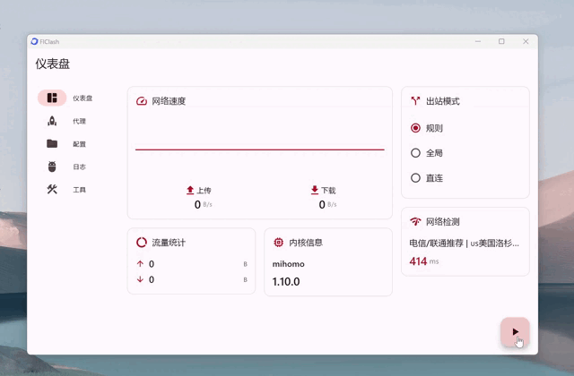
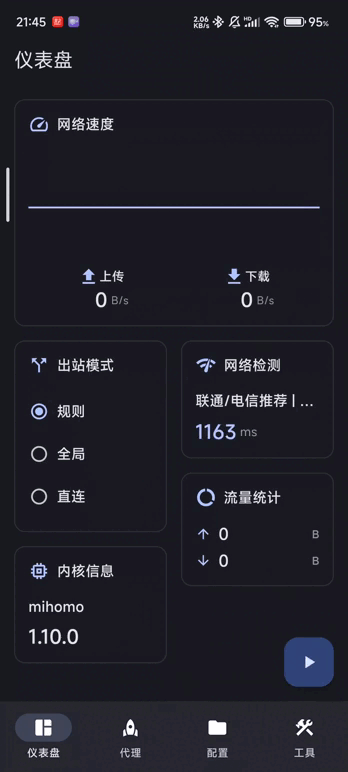

<div>

[**English**](README.md)

</div>

## FlClash

[](https://github.com/chen08209/FlClash/releases/)[](https://github.com/chen08209/FlClash/releases/)[](LICENSE)

[](https://t.me/FlClash)

基于ClashMeta的多平台代理客户端，简单易用，开源无广告。

on Desktop:
<p style="text-align: center;">
    
</p>

on Mobile:
<p style="text-align: center;">
    
</p>

## Features

✈️ 多平台: Android, Windows, macOS and Linux

💻 自适应多个屏幕尺寸,多种颜色主题可供选择

💡 基本 Material You 设计, 类[Surfboard](https://github.com/getsurfboard/surfboard)用户界面

☁️ 支持通过WebDAV同步数据

✨ 支持一键导入订阅, 深色模式

## Use

### Linux

⚠️ 使用前请确保安装以下依赖

   ```bash
    sudo apt-get install libayatana-appindicator3-dev
    sudo apt-get install libkeybinder-3.0-dev
   ```

### Android

支持下列操作

   ```bash
    com.follow.clash.action.START
    
    com.follow.clash.action.STOP
    
    com.follow.clash.action.TOGGLE
   ```

## Download

<a href="https://chen08209.github.io/FlClash-fdroid-repo/repo?fingerprint=789D6D32668712EF7672F9E58DEEB15FBD6DCEEC5AE7A4371EA72F2AAE8A12FD"></a> <a href="https://github.com/chen08209/FlClash/releases"></a>

## Build

1. 更新 submodules
   ```bash
   git submodule update --init --recursive
   ```

2. 安装 `Flutter` 以及 `Golang` 环境

3. 构建应用

    - android

        1. 安装  `Android SDK` ,  `Android NDK`

        2. 设置 `ANDROID_NDK` 环境变量

        3. 运行构建脚本

           ```bash
           dart .\setup.dart android
           ```

    - windows

        1. 你需要一个windows客户端

        2. 安装 `Gcc`，`Inno Setup`

        3. 运行构建脚本

           ```bash
           dart .\setup.dart windows --arch <arm64 | amd64>
           ```

    - linux

        1. 你需要一个linux客户端

        2. 运行构建脚本

           ```bash
           dart .\setup.dart linux --arch <arm64 | amd64>
           ```

    - macOS

        1. 你需要一个macOS客户端

        2. 运行构建脚本

           ```bash
           dart .\setup.dart macos --arch <arm64 | amd64>
           ```

## Star History

支持开发者的最简单方式是点击页面顶部的星标（⭐）。

<p style="text-align: center;">
    <a href="https://api.star-history.com/svg?repos=chen08209/FlClash&Date">
        
    </a>
</p>