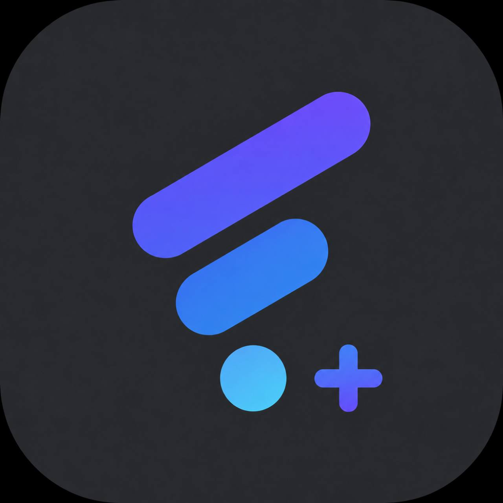
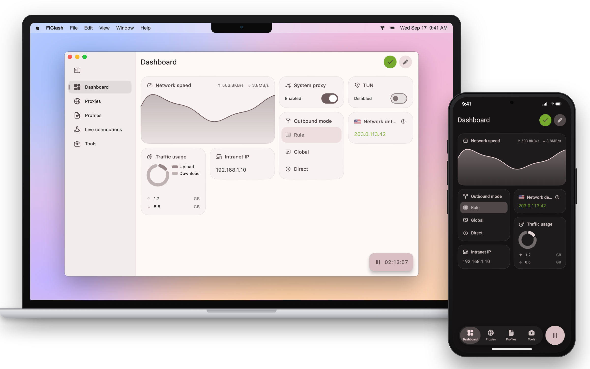

<div align="center">



# FlClash

基于 ClashMeta 的多平台代理客户端，简单易用，开源无广告。

[English](README.md) · **简体中文**

[](https://github.com/chen08209/FlClash/releases/latest)
[](https://github.com/chen08209/FlClash/releases)
[](LICENSE)
[](https://t.me/FlClash)

[官网](https://chen08209.github.io/FlClash/zh/) · [下载](#下载) · [更新日志](CHANGELOG.md) · [从源码构建](#从源码构建)

</div>

<p align="center">
  <picture>
    <source media="(prefers-color-scheme: dark)" srcset="snapshots/preview-dark.png">
    
  </picture>
</p>

## 功能

- **一个应用覆盖 Android、Windows、macOS 和 Linux**，桌面端同时提供 x64 与 ARM64 版本。
- **mihomo（Clash.Meta）内核**：规则分流、代理组、延迟测试、系统代理与 TUN 模式。
- **配置管理**：通过订阅链接或文件导入配置，内置编辑器，支持覆写脚本以及自定义规则、代理和代理组。
- **实时查看**连接、请求、DNS 查询和日志。
- **Material You 设计**：支持动态取色、浅色与深色主题，布局随屏幕从手机到桌面自适应。
- **备份与恢复**：通过 WebDAV 或本地文件。
- **平台细节**：Android 上有快捷设置磁贴、分应用代理和 Android TV 支持；桌面端有托盘菜单和全局快捷键。
- **开源无广告**，以 GPL-3.0 协议发布。

## 下载

从 [GitHub Releases](https://github.com/chen08209/FlClash/releases/latest) 获取最新版本，或打开
[官网](https://chen08209.github.io/FlClash/zh/#download)，它会自动为你的设备选好安装包。

| 平台 | 安装包 | 说明 |
| --- | --- | --- |
| Android | `arm64-v8a`、`armeabi-v7a`、`x86_64` 三种 APK | 绝大多数手机选 `arm64-v8a`。也可以通过下方的 F-Droid 仓库安装。 |
| Windows 10 及以上 | 安装版（`.exe`）或便携版（`.zip`），分 x64 与 ARM64 | 骁龙等 ARM 架构笔记本选 ARM64。 |
| macOS 12 及以上 | Apple Silicon 与 Intel 两种 DMG | 也可以通过 Homebrew 安装。 |
| Linux | `.deb`、`.rpm` 和 AppImage，分 x64 与 ARM64 | 托盘依赖见下方说明。 |

<p>
  <a href="https://chen08209.github.io/FlClash-fdroid-repo/repo?fingerprint=789D6D32668712EF7672F9E58DEEB15FBD6DCEEC5AE7A4371EA72F2AAE8A12FD"></a>
  <a href="https://github.com/chen08209/FlClash/releases/latest"></a>
</p>

**Homebrew**

```bash
brew tap chen08209/tap
brew install --cask flclash
```

**Linux 托盘图标**

`.deb` 安装包会自动安装所需依赖。使用 AppImage 或 `.rpm` 时，需要先安装 AyatanaAppIndicator 库，托盘图标才能显示：

```bash
sudo apt-get install libayatana-appindicator3-1   # Debian 与 Ubuntu
sudo dnf install libayatana-appindicator-gtk3     # Fedora
```

## 使用

**通过链接导入配置。** 打开下面格式的链接，即可把订阅导入 FlClash。`clashmeta://` 和 `flclash://` 开头的链接同样可用。

```text
clash://install-config?url=<经过 URL 编码的订阅链接>
```

**Android 自动化。** Tasker、MacroDroid 等应用可以用下面的 Action 启动 Activity，从而启动、停止或切换代理：

```text
com.follow.clash.action.START
com.follow.clash.action.STOP
com.follow.clash.action.TOGGLE
```

在电脑上也可以通过 adb 触发：

```bash
adb shell am start -a com.follow.clash.action.TOGGLE
```

## 从源码构建

需要 [Flutter](https://docs.flutter.dev/get-started/install) 3.47（正式版构建使用 3.47.4）、[Go](https://go.dev/dl/) 1.26，
以及通过 rustup 安装的 [Rust](https://rustup.rs/)。桌面端需要在对应系统上构建，Android 在任意系统上都能构建。

```bash
git clone --recursive https://github.com/chen08209/FlClash.git
cd FlClash
flutter pub get
dart setup.dart android   # 或 windows、macos、linux
```

安装包输出到 `dist/`。Go 内核和 Rust 库会在 Flutter 构建过程中一并编译。

| 平台 | 额外依赖 |
| --- | --- |
| Android | 带 NDK 的 Android SDK。加上 `--arch arm64` 可以只构建单个 ABI。 |
| Windows | 编译内核用的 GCC（MinGW-w64），以及打包安装程序用的 [Inno Setup](https://jrsoftware.org/isinfo.php) 6。 |
| macOS | Xcode 与 Node.js。脚本会通过 npm 安装 `appdmg`。 |
| Linux | Debian 或 Ubuntu。脚本会用 apt 安装构建所需的软件包，并下载 `appimagetool`。 |

其余选项可以运行 `dart setup.dart --help` 查看，例如用 `--targets` 只构建部分安装包格式。

## 支持

给仓库点一个 Star 是支持项目最简单的方式。问题讨论和更新通知请关注 [Telegram 频道](https://t.me/FlClash)，
Bug 与功能建议请提交到 [GitHub Issues](https://github.com/chen08209/FlClash/issues)。

<a href="https://star-history.com/#chen08209/FlClash&Date">
  <picture>
    <source media="(prefers-color-scheme: dark)" srcset="https://api.star-history.com/svg?repos=chen08209/FlClash&type=Date&theme=dark">
    
  </picture>
</a>

## 许可证

FlClash 以 [GPL-3.0 协议](LICENSE)发布。
