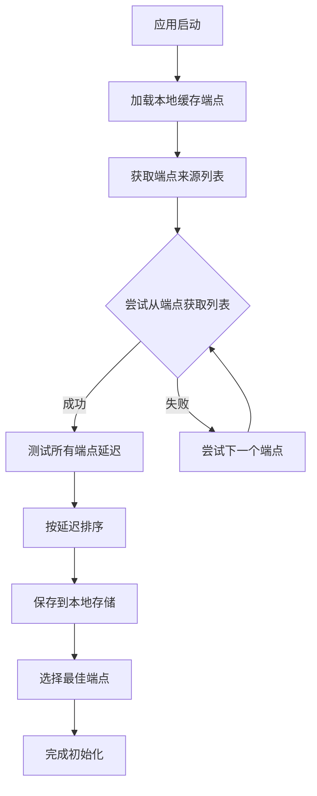

# 端点优化功能技术文档

## 概述

端点优化功能通过本地缓存机制，优先使用已验证的高质量端点来获取最新的端点列表，从而提高网络请求的成功率和响应速度。

## 核心特性

### 1. 智能端点选择
- 优先使用本地缓存的在线端点（前3个最佳）
- 自动fallback到内置端点
- 智能去重避免重复请求

### 2. 本地存储机制
- 自动保存获取的端点列表到本地存储
- 启动时加载缓存的端点信息
- 支持清除缓存功能

### 3. 延迟测试与排序
- 实时测试所有端点的响应延迟
- 按延迟排序选择最佳端点
- 标记在线/离线状态

## 实现架构

### 类结构
```dart
class EndpointService {
  // 存储键
  static const String _bestEndpointKey = 'best_endpoint';
  static const String _cachedEndpointsKey = 'cached_endpoints';
  
  // 内置端点列表
  static const List<String> _builtInEndpoints = [...];
  
  // 实例变量
  String? _currentEndpoint;
  List<EndpointInfo> _cachedEndpoints = [];
}
```

### 核心方法

#### 初始化流程
```dart
Future<void> initialize() async {
  // 1. 加载本地缓存的端点
  await _loadCachedEndpoints();
  
  // 2. 获取并测试端点
  await _fetchAndTestEndpoints();
}
```

#### 端点获取策略
```dart
List<String> _getSourceEndpoints() {
  // 1. 优先使用缓存的在线端点（前3个）
  // 2. 添加内置端点作为fallback
  // 3. 去重处理
}
```

## 工作流程



## API 接口

### 公共方法

#### `initialize()`
- **功能**: 初始化端点服务
- **返回**: `Future<void>`
- **说明**: 应用启动时调用，执行完整的端点获取和测试流程

#### `refresh()`
- **功能**: 强制刷新端点列表
- **返回**: `Future<void>`
- **说明**: 重新获取和测试所有端点

#### `retestEndpoints()`
- **功能**: 重新测试缓存的端点
- **返回**: `Future<void>`
- **说明**: 只测试已有端点，不获取新的端点列表

#### `testEndpointLatency(String endpoint)`
- **功能**: 测试单个端点的延迟
- **参数**: `endpoint` - 端点URL
- **返回**: `Future<int>` - 延迟毫秒数
- **说明**: 返回999999表示离线或超时

#### `setCurrentEndpoint(String endpoint)`
- **功能**: 手动设置当前端点
- **参数**: `endpoint` - 端点URL
- **返回**: `Future<void>`

#### `clearCache()`
- **功能**: 清除所有缓存
- **返回**: `Future<void>`
- **说明**: 清除本地存储和内存中的端点信息

### 属性访问器

#### `currentEndpoint`
- **类型**: `String`
- **说明**: 获取当前使用的最佳端点

#### `cachedEndpoints`
- **类型**: `List<EndpointInfo>`
- **说明**: 获取缓存的端点列表

## 存储结构

### SharedPreferences 键值

| 键名 | 类型 | 说明 |
|------|------|------|
| `best_endpoint` | String | 当前最佳端点URL |
| `cached_endpoints` | String | JSON序列化的端点列表 |

### EndpointInfo 数据结构
```dart
class EndpointInfo {
  final int id;              // 端点ID
  final String name;         // 端点名称
  final String point;        // 端点URL
  final String tags;         // 标签
  final int isActive;        // 是否激活
  final int latencyMs;       // 延迟毫秒数
  final bool isOnline;       // 是否在线
  final String lastTestedAt; // 最后测试时间
  // ...其他字段
}
```

## 配置参数

### 网络请求配置
- **连接超时**: 15秒
- **代理设置**: `PROXY 192.168.31.108:8888`（开发调试用）
- **用户代理**: `PostmanRuntime-ApipostRuntime/1.1.0`

### 端点选择策略
- **缓存端点数量**: 最多使用前3个最佳端点
- **离线判定**: 延迟 >= 999999ms
- **排序方式**: 按延迟升序排列

## 错误处理

### 异常情况
1. **网络连接失败**: 自动尝试下一个端点
2. **JSON解析错误**: 记录日志并跳过该端点
3. **存储访问失败**: 使用内存缓存继续运行
4. **所有端点离线**: 使用内置端点作为fallback

### 日志输出
```
EndpointService: Initializing...
EndpointService: Loaded 5 cached endpoints from local storage
EndpointService: Using 3 cached endpoints as source
EndpointService: Successfully fetched 12 endpoints from cached_endpoint
EndpointService: Selected best endpoint: https://api.example.com (45ms)
```

## 性能优化

### 缓存策略
- 内存缓存: 避免重复的网络请求
- 本地存储: 减少应用启动时间
- 智能选择: 优先使用高质量端点

### 网络优化
- 并发测试: 同时测试多个端点（控制并发数）
- 超时控制: 避免长时间等待
- 失败快速切换: 立即尝试下一个端点

## 使用示例

### 基本用法
```dart
final endpointService = EndpointService();

// 初始化
await endpointService.initialize();

// 获取当前最佳端点
final currentEndpoint = endpointService.currentEndpoint;

// 手动刷新
await endpointService.refresh();

// 清除缓存
await endpointService.clearCache();
```

### 集成到API服务
```dart
class ApiService {
  final EndpointService _endpointService = EndpointService();
  
  String get baseUrl => '${_endpointService.currentEndpoint}/api/v1';
  
  Future<void> initialize() async {
    await _endpointService.initialize();
  }
}
```

## 维护说明

### 添加新的内置端点
在 `_builtInEndpoints` 列表中添加新的端点URL：
```dart
static const List<String> _builtInEndpoints = [
  'https://new-endpoint.example.com',
  // ...现有端点
];
```

### 修改缓存策略
调整 `_getSourceEndpoints()` 方法中的取值数量：
```dart
.take(5) // 从3改为5，使用前5个最佳端点
```

### 调整超时时间
修改 `testEndpointLatency()` 方法中的超时设置：
```dart
client.connectionTimeout = const Duration(seconds: 20); // 从15秒改为20秒
```

## 版本历史

- **v1.0**: 基础端点管理功能
- **v2.0**: 添加本地缓存机制
- **v2.1**: 优化智能端点选择策略
- **v2.2**: 增强错误处理和日志记录
